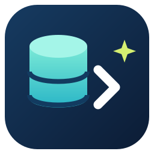
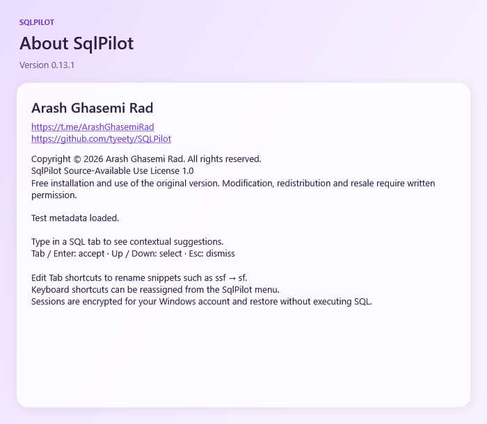

<p align="center"></p>

# SqlPilot

A keyboard-first SQL development assistant for **SQL Server Management Studio (SSMS)**.

Created by **Arash Ghasemi Rad** · [Telegram: @ArashGhasemiRad](https://t.me/ArashGhasemiRad)

[Download releases](https://github.com/tyeety/SQLPilot/releases) · [فارسی](README.fa.md) · [License](LICENSE)

SqlPilot provides local, database-aware completion, editable snippets, SQL diagnostics and a searchable query library. The interface and installer are in English. Current version: **0.13.1**. AI/Codex generation is not included.

## Install

1. Download `SqlPilotSetup-0.13.1.exe` from the official [Releases](https://github.com/tyeety/SQLPilot/releases) page.
2. Save your queries and close the SSMS versions you want to update.
3. Run the installer, select the detected SSMS versions and click **Install selected components**. Administrator access is required for host installation.
4. Restart SSMS, open a connected SQL query tab and use the **SqlPilot** toolbar button.

The installer displays existing versions and identifies Install, Upgrade, Reinstall or Downgrade. Downgrades require confirmation; existing installations are backed up. Do not treat a copied extension folder as proof that SSMS loaded it.

The executable is currently unsigned. Download it only from this repository's official releases and compare its SHA-256 with the release checksum file. The installer is self-contained; no separate .NET 8 installation is required to run it.

## Compatibility

The adapters have been built against **SSMS 20 and SSMS 22** on Windows. Host builds and installer self-tests are separate from interactive SSMS verification. See [validation](docs/VALIDATION.md).

SSMS is the editor; SQL Server is the database engine. Host APIs, authentication and metadata permissions affect compatibility. Future SSMS releases and every historical SQL Server version are not guaranteed. Schema scanning needs permission to see database metadata. Hidden or encrypted definitions and unsupported host APIs have limitations.

## Features

- Contextual tables, views, columns, procedures, functions and SQL keyword suggestions; flexible initials/substring matching, subtle matched-character highlighting and schema provenance.
- Alias-aware completion and procedure parameter placeholders. Tab and Shift+Tab move through inserted parameters.
- JOIN targets ranked by declared foreign keys; ON conditions include composite and reverse relationships. Relations are never guessed solely from column names.
- **Tab on a SELECT projection `*`** expands visible columns vertically. A small editor hint explains the action when expansion is available.
- Editable Tab snippets, such as `ssf` → `SELECT * FROM`, and configurable keyboard shortcuts.
- Local syntax errors, warnings and improvement suggestions with per-section underlines, explanations and safe fixes where available.
- Formatting that preserves comments and optional conversion of typed `&&`, `||`, `==`, `!=` in SQL conditions.
- SQL Library with categories, tags, search, import/export; query history; reference navigation and Object Explorer lookup.
- Encrypted tab/session checkpoints and connection recovery for supported connection types.

The toolbar uses one **SqlPilot** button with grouped actions. Completion, appearance, bracket insertion, aliases, diagnostics and session recovery are configurable in Settings.

## Default keys

| Key | Action |
| --- | --- |
| Ctrl+Space | Explicit completion, including revisited or mistyped identifiers |
| Tab / Enter | Accept a suggestion |
| Up / Down | Select a suggestion |
| Esc | Dismiss; blank lines stay quiet until typing or explicit completion |
| Tab at a projection star | Expand available columns |
| Alt+Enter or Ctrl+. | Diagnostic explanation and available fixes |
| Ctrl+Shift+F | Format selection/document |
| Ctrl+Shift+A | Analyze and fix |
| Ctrl+Shift+R | Refresh schema |
| Ctrl+Shift+C | Metadata connection |
| Ctrl+Shift+H | Query history |
| Ctrl+Shift+L | SQL Library |
| Ctrl+Shift+S | Save SQL to Library |
| F12 | Go to reference; procedures open as ALTER scripts |
| Ctrl+F12 | Locate an object in the connected Object Explorer |

Bindings can conflict with other SSMS extensions. Edit them under **SqlPilot → Keyboard shortcuts**. SqlPilot can suppress other completion providers while its completion is enabled and restore their prior state afterward.

## Data and behavior

Completion and diagnostics run locally; there is no AI service or telemetry integration. Schema refresh reads SQL Server metadata. Completion, fixes and reference scripts change editor text only; they do not execute your SQL.

Settings, snippets, Library, history and sessions are stored under `%LOCALAPPDATA%\SqlPilot`. Session text and remembered connection details are protected with Windows DPAPI for the current account. History and Library are local files and can contain sensitive SQL: protect the Windows account and filesystem. Entra/token renewal and some advanced/cross-database SQL scopes are not fully supported.

## Build and test

Requirements: Windows, the **.NET 8 SDK**, and an installed SSMS 20 or 22 host for adapter builds. NuGet access is required for the first restore. Run commands from the repository root:

```powershell
pwsh -File scripts/Test.ps1
pwsh -File scripts/Build.ps1
pwsh -File scripts/Build-Setup.ps1
```

For a custom installation path:

```powershell
pwsh -File scripts/Build.ps1 -Ssms20 'D:\SSMS20\Common7\IDE'
```

The installer is written to `artifacts/release/SqlPilotSetup-0.13.1.exe`. Build products and installer payloads are ignored by Git. The installer compiles host adapters using the selected installation's editor assemblies; successful compilation cannot guarantee future host compatibility.

`Test.ps1` runs core and Windows workspace fixtures without executing application SQL. Optional LocalDB metadata testing requires an explicitly named, dedicated test instance; see [building](docs/BUILDING.md). [GitHub Actions](.github/workflows/validate.yml) runs the local tests and formatting checks; it does not simulate a connected SSMS editor.

## Source layout

| Location | Purpose |
| --- | --- |
| `src/SqlPilot.Core` | Completion, T-SQL parsing, formatting, diagnostics and snippets |
| `src/SqlPilot.Ssms` | Editor integration, metadata access, Library, sessions and navigation |
| `src/SqlPilot.Setup` | SSMS detection, selected-host installer, backups and version checks |
| `src/Shared` | Shared design and author/product identity |
| `tests` | Core, workspace and opt-in LocalDB checks |
| `scripts` | Build, installer packaging and test entry points |
| `assets`, `docs`, `examples` | Original artwork, documentation and keyboard examples |
| `third-party/licenses` | Dependency licenses and notices |

## About preview



Offscreen WPF layout preview; see [validation](docs/VALIDATION.md).

## License and author

Copyright © 2026 **Arash Ghasemi Rad**. All rights reserved.

This is **source-available**, not OSI open source. [LICENSE](LICENSE) allows free installation and use of the original version, including internal business use and copies needed to install/build it. Modification, code reuse, redistribution and resale require the author's written permission. Preferences, your own snippets and your own SQL remain yours.

Public GitHub hosting permits viewing and platform forks under [GitHub's terms](https://docs.github.com/en/site-policy/github-terms/github-terms-of-service#5-license-grant-to-other-users); a license cannot technically prevent copying. Independent dependencies retain their own [licenses](THIRD_PARTY_NOTICES.md).

Report bugs through [Issues](https://github.com/tyeety/SQLPilot/issues), without passwords, connection strings or confidential query/data content. For permissions or author contact: [@ArashGhasemiRad](https://t.me/ArashGhasemiRad). See [contribution policy](CONTRIBUTING.md).
